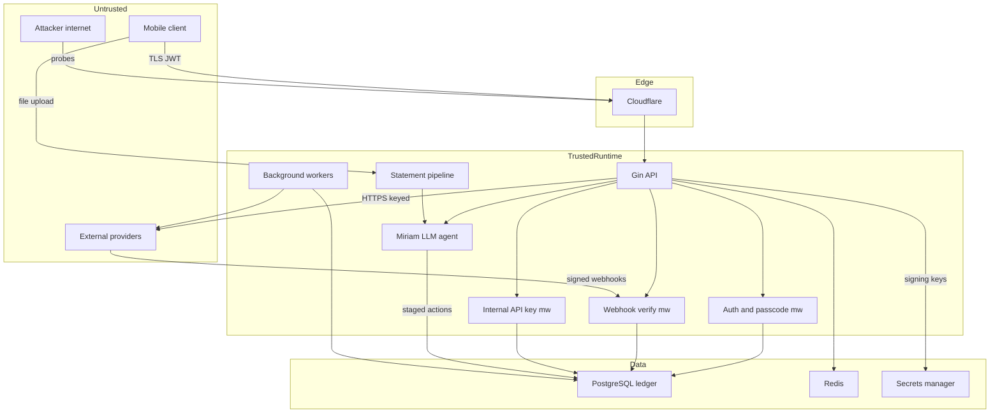

# Rail Backend — Threat Model

> Scope: `github.com/rail-service/rail_service` (Go fintech backend), branch `main`. Prepared for AppSec review. Every architectural claim is anchored to a repo path. Assumptions are explicit; conditional findings are marked.
>
> **Remediation pass (2026-06-13):** after deeper code verification, most threats were confirmed already-mitigated by existing controls. See [Remediation status](#remediation-status-2026-06-13) at the end for what was code-fixed, what was verified safe, and what remains for infra/ops or a dedicated review.

## Executive summary

Rail is an internet-facing, multi-tenant Go/Gin API that custodies real USDC and fiat, splits every deposit 70/30 via a double-entry ledger, and integrates a dozen external money/identity providers plus an LLM "Miriam" agent. The platform is **security-mature**: JWT signing-method pinning, token/session/user blacklists, passcode-gated withdrawals with daily caps, HMAC webhook verification with replay protection that fails closed in production, AES-GCM PII encryption, parameterized SQL, and strict config validation are all present and evidenced. The residual risk concentrates in **a few high-value choke points where a single logic flaw moves money**: (1) the `/internal/*` money-minting endpoints guarded only by a static API key (exposure unconfirmed); (2) the integrity of the deposit→allocation→ledger pipeline driven by provider webhooks; (3) the LLM agent's ability to stage fund-moving actions while ingesting attacker-controlled bank-statement text (prompt injection → social-engineered confirmation); and (4) cross-tenant authorization on the many per-user resource handlers. The top theme is **integrity of money movement**, not classic memory-safety or injection.

## Scope and assumptions

**In-scope (runtime):**
- `internal/api/` — Gin HTTP layer (handlers, middleware, routes), GraphQL.
- `internal/domain/services/` — business logic incl. `allocation`, `funding`, `withdrawal`, `spending`, `ai`, `entity_secret`, `kyc`.
- `internal/infrastructure/` — provider adapters, repositories, config, DI.
- `internal/workers/` — background processors that mutate the ledger.
- `pkg/auth`, `pkg/crypto`, `pkg/webhook`, `pkg/security`, `pkg/idempotency`.

**Out-of-scope:** `test/`, `*_test.go`, `umbra-sidecar/` (separate Node service, only touched for Umbra work), CI/build tooling, the many root-level `*-task-def.json` scratch files, and cloud-infra / insider compromise (not modeled unless noted).

**Explicit assumptions (correct any that are wrong):**
- A1. Production API is internet-exposed behind Cloudflare (`isBehindCloudflare` honored in rate limiting, [internal/api/middleware/middleware.go:305](internal/api/middleware/middleware.go)), serving untrusted mobile clients; single shared PostgreSQL, multi-tenant.
- A2. Wallet-signing material (Circle entity secret) is held in a secrets manager / KMS at runtime (**confirmed by owner**); `aws-sdk-go-v2/service/secretsmanager` is a dependency. This downgrades "key at rest in env" concerns.
- A3. **Open question (owner unsure):** whether `/internal/*` is network-isolated or internet-routable. Ranked **conservatively as internet-reachable** below; if isolated, downgrade TM-001 from high to medium.
- A4. Attacker = unauthenticated internet user + authenticated malicious tenant attacking own/other accounts. Not a cloud-admin or DB-level insider.
- A5. The Miriam agent **can stage fund-moving actions** (owner-confirmed); code shows these are staged into a pending-action confirmation flow ([internal/domain/services/ai/orchestrator_plan_actions.go:15](internal/domain/services/ai/orchestrator_plan_actions.go)), and the staged transfer is internal (spend→stash). Severity ranked high (not critical) on that basis; **conditional on the confirmation step being non-bypassable and not auto-approvable.**

**Open questions that would change ranking:** internal-endpoint network exposure (A3); whether the AI pending-action confirmation can ever be auto-executed without a fresh user gesture; whether bank-statement extracted text is ever fed into the same LLM context that has tool-calling enabled.

## System model

### Primary components
- **API server** (`cmd/main.go` → `internal/app/application.go`): Gin router, composition root wires everything via `internal/infrastructure/di/container.go`.
- **PostgreSQL**: primary store + double-entry ledger (`internal/infrastructure/repositories/`, `migrations/`).
- **Redis**: sessions, rate-limit state, webhook replay cache, job queue (`internal/infrastructure/cache/`, `pkg/jobqueue`).
- **Background workers** (~45, `internal/workers/`): allocation, autoinvest, yield_distribution, reconciliation, `*_recovery`, copy_trading — mutate the ledger off the request path.
- **External providers** (`internal/infrastructure/adapters/`): Bridge & Circle (custody/wallets — mid-migration), Alpaca (brokerage), Reflect (yield), Paj/Chainrails/CCTP (rails/bridging), Sumsub/Didit (KYC), ElevenLabs + AWS Bedrock/OpenAI/Gemini (AI), R2/S3 (storage), SES/SNS (notifications), Textract (statement OCR).
- **Miriam AI orchestrator** (`internal/domain/services/ai/`): tool-calling agent + voice (ElevenLabs) that can read finances and stage actions.

### Data flows and trust boundaries
- **Internet → Cloudflare → API**: HTTPS; JSON bodies, credentials, JWTs. Guarantees: TLS, global rate limit ([routes.go:131](internal/api/routes/routes.go)), CORS allowlist, `SecurityHeaders`, `ScannerBlock`, `RequestSizeLimit`, `InputValidation`, CSRF token issuance. Untrusted input.
- **Mobile client → /api/v1/auth/***: credentials/OTP. Login rate-limiting + CAPTCHA + tiered limiter ([internal/api/middleware/enhanced_auth.go:143](internal/api/middleware/enhanced_auth.go)). No Bearer required (public).
- **Mobile client → protected /api/v1/***: Bearer JWT (HS256, method-pinned, [pkg/auth/jwt.go:97](pkg/auth/jwt.go)); blacklist + session validation ([internal/api/middleware/enhanced_auth.go:71](internal/api/middleware/enhanced_auth.go)). Sensitive money ops additionally require a passcode-verified session ([routes.go:995](internal/api/routes/routes.go)) and capability (KYC tier) gates.
- **Provider → /api/v1/webhooks/* and /kyc/*/webhook**: signed event payloads (deposits, KYC results, trade fills). Guarantees: HMAC-SHA256 constant-time verify ([pkg/webhook/verify.go:14](pkg/webhook/verify.go)), replay protection ([pkg/security/webhook_replay_protection.go](pkg/security/webhook_replay_protection.go)), IP allowlist, per-provider secrets, fail-closed in prod ([routes.go:451](internal/api/routes/routes.go)). Untrusted transport, authenticated by secret.
- **Ops/automation → /internal/***: static `INTERNAL_API_KEY` (constant-time compare, [internal/api/middleware/middleware.go:598](internal/api/middleware/middleware.go)) + 5 req/min. Includes money-minting `POST /internal/deposit/credit` and `POST /internal/stash/transfer-to-spend` ([routes.go:218](internal/api/routes/routes.go), [routes.go:271](internal/api/routes/routes.go)).
- **API/worker → PostgreSQL**: parameterized queries (`$1,$2`, [internal/infrastructure/repositories/wallet_repository.go:643](internal/infrastructure/repositories/wallet_repository.go)); ledger mutations confined to service layer.
- **API → external providers**: HTTPS + API keys; wallet signing via Circle entity-secret ciphertext (`internal/domain/services/entity_secret/`).
- **LLM agent → backend tools**: model output drives `StageOperatingPlanAction`; fund moves are staged to a confirmation flow ([orchestrator_plan_actions.go:15](internal/domain/services/ai/orchestrator_plan_actions.go)). Untrusted model output crosses into money-adjacent actions.
- **User → statement upload**: multipart PDF/image (≤25 MB, [routes.go ~1457](internal/api/routes/routes.go)) → PDF extract → Textract → LLM parse (`internal/domain/services/statement/`). Attacker-controlled file + text.

#### Diagram

## Assets and security objectives

| Asset | Why it matters | Security objective |
|---|---|---|
| Custodied USDC + fiat balances | Direct user funds; theft or loss is irreversible | C / I / A |
| Circle/Bridge wallet-signing material (entity secret) | Controls on-chain transfers; compromise = total fund drain | C / I |
| Double-entry ledger & balances | Source of truth; drift creates or destroys money | I |
| Deposit/allocation pipeline integrity | Forged/duplicated deposits credit unfunded balances | I |
| KYC PII (passport, face, address) | Regulatory (NDPR/GDPR), user harm on breach | C |
| JWT secret, encryption key, INTERNAL_API_KEY, webhook & provider secrets | Compromise enables auth bypass / mass fund movement | C |
| User sessions, passcodes, devices | Account takeover vector | C / I |
| Audit logs & monitoring | Detection & forensics; poisoning blinds response | I / A |
| Brokerage positions (Alpaca, copy-trading) | Unauthorized trades, follower fund misuse | I / A |

## Attacker model

### Capabilities
- Send arbitrary HTTPS requests to all public endpoints (auth, KYC/provider webhooks, voice server-tool, statement upload, health).
- Register a legitimate account and obtain a valid JWT + passcode session; probe every authenticated handler with their own and guessed IDs (IDOR/cross-tenant).
- Upload crafted PDFs/images and embed adversarial text aimed at the OCR/LLM pipeline (prompt injection).
- Replay or forge webhook bodies; spray credentials/OTP; attempt session fixation; brute-force the static internal API key if the endpoint is reachable (A3).
- Drive the Miriam agent via chat/voice to stage actions and craft confirmation prompts.

### Non-capabilities
- No DB/Redis network access, no host/container shell, no cloud IAM or secrets-manager access (A2/A4).
- Cannot read provider-side secrets or forge valid HMAC signatures without the per-provider secret.
- Cannot bypass TLS or Cloudflare WAF wholesale; cannot trivially read another user's JWT.

## Entry points and attack surfaces

| Surface | How reached | Trust boundary | Notes | Evidence |
|---|---|---|---|---|
| Auth endpoints | `POST /api/v1/auth/*` (public) | Internet → API | Login rate-limit + CAPTCHA + tiered limiter | [routes.go:600](internal/api/routes/routes.go), [enhanced_auth.go:143](internal/api/middleware/enhanced_auth.go) |
| Provider webhooks | `POST /api/v1/webhooks/{bridge,alpaca}` | Provider → API | HMAC + replay + IP allowlist, fail-closed prod | [routes.go:1625](internal/api/routes/routes.go), [pkg/webhook/verify.go:14](pkg/webhook/verify.go) |
| KYC webhooks | `POST /api/v1/kyc/{sumsub,didit}/webhook` (public) | Provider → API | Verified via provider signature funcs | [routes.go:723](internal/api/routes/routes.go) |
| Internal ops | `POST /internal/deposit/credit`, `/internal/stash/transfer-to-spend`, `DELETE /internal/users/:id` | Ops → API | Static `INTERNAL_API_KEY` + 5 rpm; **moves/mints money** | [routes.go:160](internal/api/routes/routes.go), [routes.go:218](internal/api/routes/routes.go) |
| Withdrawals | `POST /api/v1/withdrawals/*` | Authed user → API | Passcode session + 3/day + daily cap + capability gate | [routes.go:983](internal/api/routes/routes.go) |
| AI / voice | `POST /api/v1/ai/voice/execute-tool`, `/ai/voice/server-tool/:tool_name` (webhook-secret), WS voice | User/LLM → API | Agent stages money-adjacent actions | [routes.go:1467](internal/api/routes/routes.go), [orchestrator_plan_actions.go](internal/domain/services/ai/orchestrator_plan_actions.go) |
| Statement upload | `POST /api/v1/ai/v2/statement/upload` (≤25 MB) | User → parser/LLM | PDF/image → Textract → LLM | [routes.go:1457](internal/api/routes/routes.go), `internal/domain/services/statement/` |
| Per-user resources | `GET/POST /api/v1/{users,account,p2p,deposits,...}` | Authed user → API | IDOR surface across ~70 services | `internal/api/handlers/` |
| Dashboard auth | `POST /api/v1/dashboard/auth` (public, 5 rpm) | Internet → API | Admin/analytics access path | [routes.go:646](internal/api/routes/routes.go) |
| Health/metrics | `GET /health`, `/metrics` (internal key) | Internet/Ops → API | Metrics gated by internal key | [routes.go:150](internal/api/routes/routes.go) |

## Top abuse paths

1. **Forged/duplicated deposit credit.** Attacker replays or forges a deposit webhook (or hits `/internal/deposit/credit` if reachable) → allocation worker splits 70/30 → spend balance credited without real funds → attacker withdraws. Impact: direct loss. (TM-002, TM-001)
2. **Static internal-key brute force / leak.** `INTERNAL_API_KEY` leaks (logs, config, CI) or is guessed at 5 rpm if internet-reachable → attacker calls `/internal/stash/transfer-to-spend` or `/deposit/credit` to move/mint money for arbitrary users. (TM-001)
3. **Cross-tenant IDOR.** Authenticated user passes another user's UUID/resource ID to a per-user handler lacking an ownership check → reads PII or manipulates another tenant's obligations/automations/withdrawals. (TM-003)
4. **Prompt injection via bank statement → social-engineered transfer.** Attacker uploads a statement whose text instructs the LLM to propose a transfer/automation; if extracted text shares context with the tool-calling agent, a staged action is crafted and the user confirms a manipulated amount/destination. (TM-004)
5. **Webhook replay to double-process trade/yield/KYC events.** Replay a valid signed event before/after cache expiry → duplicate yield distribution, KYC state flip, or trade mirroring. (TM-005)
6. **Withdrawal control bypass via logic flaw.** Race or state confusion across `withdrawal`, `withdrawal_cooling`, recovery workers, and idempotency → exceed daily cap, double-spend, or revive a cancelled withdrawal. (TM-006)
7. **Ledger drift via concurrent allocation.** Concurrent deposits/transfers race the double-entry write → balance > backing; reconciliation lags. (TM-007)
8. **Account takeover via auth weaknesses.** Credential stuffing / OTP brute force / session fixation despite rate limits → full account control incl. passcode reset. (TM-008)
9. **Copy-trading abuse.** Malicious "conductor" track or follower-mirroring flaw deploys follower capital into attacker-favorable Alpaca trades. (TM-009)
10. **PII exfiltration through KYC webhook spoofing or storage misref.** Forged KYC webhook flips verification, or a statement/KYC file reference (R2/S3 key) is guessable and served cross-tenant. (TM-010)

## Threat model table

| Threat ID | Threat source | Prerequisites | Threat action | Impact | Impacted assets | Existing controls (evidence) | Gaps | Recommended mitigations | Detection ideas | Likelihood | Impact severity | Priority |
|---|---|---|---|---|---|---|---|---|---|---|---|---|
| TM-001 | Internet/insider w/ leaked key | `/internal/*` reachable (A3 unresolved) or key leaks | Call `/internal/deposit/credit` or `/stash/transfer-to-spend` to mint/move funds | Direct fund creation/movement for any user | Balances, ledger | Constant-time key compare; 5 rpm; idempotency key on transfer ([middleware.go:598](internal/api/middleware/middleware.go), [routes.go:306](internal/api/routes/routes.go)) | Single static shared secret; exposure unconfirmed; no per-request signing or mTLS; key brute-forceable if internet-routable | Network-isolate `/internal/*` (private LB/VPC/mTLS); rotate to short-lived signed tokens; require dual-control + structured audit on money-minting routes | Alert on any `/internal/deposit/credit` call; baseline volume; alert on auth failures to `/internal/*` | Medium | High | **high** |
| TM-002 | Provider impersonator | Network path to webhook URL | Forge/replay deposit webhook to credit unfunded balance | Phantom deposits → withdrawable funds | Deposit pipeline, balances | HMAC verify + replay cache + IP allowlist + fail-closed prod ([routes.go:451](internal/api/routes/routes.go), [verify.go:14](pkg/webhook/verify.go), [webhook_replay_protection.go](pkg/security/webhook_replay_protection.go)) | Replay window vs cache TTL; reconciliation-only catch for some drift; provider event idempotency depends on event-id handling | Enforce idempotent ledger credit keyed on provider event ID; reconcile credited deposits against provider balance before allowing withdrawal; shrink replay window | Reconcile deposit credits vs provider settlements; alert on credit-without-settlement | Low | High | **high** |
| TM-003 | Authenticated tenant | Valid JWT | Supply another user's IDs to per-user handlers lacking ownership checks | Cross-tenant data read / state change | PII, balances, obligations | JWT sets `user_id`; passcode/capability gates on money ops ([enhanced_auth.go:133](internal/api/middleware/enhanced_auth.go)) | ~70 service packages; no central object-level authZ helper visible; IDOR likelihood scales with handler count | Centralize ownership assertion (resource.user_id == ctx user) in a shared guard; add IDOR tests per handler; default-deny on missing owner check | Log/alert on handler returning resource whose owner ≠ caller | Medium | High | **high** |
| TM-004 | Attacker via uploaded content | Statement upload + LLM shares tool context | Embed injection in statement text to make agent stage transfer/automation | Social-engineered fund move / unwanted automation | Balances, agent integrity | Actions staged to confirmation flow; internal spend→stash only ([orchestrator_plan_actions.go:15](internal/domain/services/ai/orchestrator_plan_actions.go)) | Confirmation UX may be bypassable/auto-approved (unverified, A5); extracted text may share LLM context with tools; no clear content/tool isolation | Isolate document-extraction LLM from tool-calling agent; never let parsed text reach a tool-enabled context; require explicit fresh-gesture confirm with server-rendered amount/destination; allowlist agent tools | Log staged-action source; alert when staged action references upload-derived params | Medium | High | **high** |
| TM-005 | Provider impersonator | Valid past event copy | Replay signed trade/yield/KYC event | Duplicate yield, KYC flip, double trade mirror | Ledger, KYC, trades | Replay protection + per-provider secrets ([webhook_replay_protection.go](pkg/security/webhook_replay_protection.go)) | Effectiveness depends on event-ID dedup persistence vs Redis TTL | Persist processed event IDs durably (DB unique constraint) beyond cache TTL; idempotent handlers per event ID | Alert on duplicate provider event IDs | Low | Medium | **medium** |
| TM-006 | Authenticated tenant | Valid passcode session | Race/replay withdrawal init across cooling/recovery paths | Cap bypass / double withdrawal | Balances | Passcode session + 3/day + daily caps + capability gate + cooling service ([routes.go:983](internal/api/routes/routes.go)) | Multi-component flow (withdrawal, cooling, recovery workers) invites TOCTOU | Single transactional state machine with DB-level row lock + idempotency on initiation; property tests for cap/race | Alert on >cap attempts; reconcile withdrawal sum vs ledger debits | Low | High | **medium** |
| TM-007 | Authenticated tenant | Concurrent deposits/transfers | Race the double-entry allocation write | Balance exceeds backing; drift | Ledger | Double-entry + reconciliation/recovery workers; idempotency keys | Concurrency correctness not provable from review; drift caught after the fact | Enforce serializable/row-locked ledger writes; add concurrency tests (a `ledger_concurrency_test.go` exists — extend) | Continuous reconciliation drift metric + alert threshold | Low | High | **medium** |
| TM-008 | Internet attacker | Target email/phone | Credential stuffing / OTP brute / session fixation | Account takeover | Sessions, balances | Login rate-limit + CAPTCHA + tiered + per-user limits; token/user blacklist ([enhanced_auth.go:143](internal/api/middleware/enhanced_auth.go)) | OTP entropy/lockout and session rotation on privilege change not verified | Enforce OTP lockout + rotate session on passcode/2FA change; bind refresh tokens to device (device-bound JWT exists) | Alert on impossible-travel / many-account same-IP login | Medium | High | **medium** |
| TM-009 | Malicious conductor / follower flaw | Conductor role or mirror bug | Publish track / exploit mirroring to misuse follower capital | Unauthorized trades, follower loss | Brokerage positions | Copy-trading service + worker; Alpaca as broker | Conductor vetting and mirror authorization not reviewed here | Cap mirrored exposure per follower; require follower opt-in per track change; validate conductor identity/limits | Alert on outlier mirrored allocation vs track | Low | Medium | **medium** |
| TM-010 | Internet/authed attacker | Webhook path or guessable storage key | Spoof KYC webhook or fetch another tenant's stored file | PII exposure / false verification | KYC PII | KYC signature verification; R2/S3 storage | Storage object-key unguessability and access scoping not verified | Use unguessable keys + per-object authZ + signed URLs with short TTL; verify KYC webhook signature on every provider | Alert on KYC state change without matching signed event; access logs on storage | Low | High | **medium** |
| TM-011 | Authenticated tenant | Valid JWT | Algorithm-confusion / weak-secret JWT forgery | Auth bypass | Sessions, all assets | HS256 method pinned; secret ≥32 enforced ([jwt.go:97](pkg/auth/jwt.go), [config.go:1496](internal/infrastructure/config/config.go)) | Symmetric secret shared across instances; rotation story unclear | Document/operate JWT secret rotation; consider asymmetric (RS/EdDSA) to limit blast radius of secret leak | Alert on tokens with unexpected `alg`/claims | Low | High | **low** |
| TM-012 | Internet attacker | Public endpoint | Volumetric DoS on expensive paths (statement OCR, AI) | Availability degradation, cost | Availability, compute $ | Global + per-user + auth rate limits; body size limits; ScannerBlock | LLM/OCR calls are costly and downstream-bound | Add concurrency/cost quotas per user on AI & statement pipelines; circuit-break provider calls (pkg/circuitbreaker exists) | Alert on per-user AI/OCR spend spikes | Medium | Low | **low** |

## Criticality calibration

For this repo (real custody, multi-tenant, internet-exposed):
- **Critical** — Unauthenticated remote fund theft or signing-key compromise; cross-tenant fund movement with no auth. *Examples:* signing-key/entity-secret exfiltration; unauthenticated mint via `/internal/*` if proven internet-open and key-guessable; auth bypass granting arbitrary-account money movement.
- **High** — Conditions-met fund theft/integrity loss or mass PII exposure. *Examples:* TM-001 (static-key money-minting, exposure unconfirmed), TM-002 (forged deposit credit), TM-003 (cross-tenant IDOR on money/PII), TM-004 (prompt-injection staged transfer).
- **Medium** — Targeted/limited fund impact, single-tenant data exposure, or controls likely-but-unproven. *Examples:* TM-005, TM-006, TM-007, TM-008, TM-009, TM-010.
- **Low** — Strong existing controls, narrow preconditions, or non-fund impact. *Examples:* TM-011 (JWT, well-controlled), TM-012 (DoS with rate limits in place).

## Focus paths for security review

| Path | Why it matters | Related Threat IDs |
|---|---|---|
| [internal/api/routes/routes.go:160-330](internal/api/routes/routes.go) | `/internal/*` money-minting endpoints + their only auth layer | TM-001 |
| [internal/api/middleware/middleware.go:594-600](internal/api/middleware/middleware.go) | Internal API-key comparison and rate-limit binding | TM-001 |
| `internal/domain/services/funding/` + `internal/workers/deposit_allocation_recovery/` | Deposit→allocation→ledger credit idempotency | TM-002, TM-007 |
| `internal/api/handlers/webhooks/` + [pkg/security/webhook_replay_protection.go](pkg/security/webhook_replay_protection.go) | Webhook event-ID dedup durability vs replay window | TM-002, TM-005 |
| `internal/api/handlers/` (per-user handlers, esp. `account/`, `p2p/`, `investing/`) | Object-level authorization / IDOR across ~70 services | TM-003, TM-010 |
| [internal/domain/services/ai/orchestrator_plan_actions.go](internal/domain/services/ai/orchestrator_plan_actions.go) + `orchestrator_financial_governance.go` | Agent-staged fund actions and confirmation gating | TM-004 |
| `internal/domain/services/statement/` (`pipeline.go`, `transaction_parser.go`, `validation.go`) | Untrusted file → OCR → LLM context isolation | TM-004, TM-012 |
| `internal/domain/services/withdrawal/` + `internal/domain/services/withdrawal_cooling/` + `internal/workers/withdrawal_recovery/` | Withdrawal state machine TOCTOU / cap bypass | TM-006 |
| `internal/infrastructure/repositories/ledger_*` (+ existing `ledger_concurrency_test.go`) | Double-entry concurrency correctness | TM-007 |
| `internal/domain/services/entity_secret/` | Circle signing-secret handling lifecycle | Critical-class |
| `internal/domain/services/copytrading/` + `internal/workers/copy_trading_worker/` | Follower-capital authorization and exposure caps | TM-009 |
| [pkg/auth/jwt.go](pkg/auth/jwt.go), `device_bound_jwt.go` + [internal/infrastructure/config/config.go:1490-1555](internal/infrastructure/config/config.go) | Token issuance/validation, secret strength & rotation | TM-008, TM-011 |

## Quality check
- **Entry points covered:** auth, provider webhooks, KYC webhooks, internal ops, withdrawals, AI/voice + server-tool, statement upload, per-user resources, dashboard auth, health/metrics — all mapped to ≥1 threat.
- **Trust boundaries in threats:** Internet→API (TM-008, TM-012), Provider→API (TM-002, TM-005, TM-010), Ops→API internal (TM-001), Authed-tenant→API (TM-003, TM-006, TM-007), LLM→tools (TM-004), file→parser (TM-004) — each appears.
- **Runtime vs CI/dev separation:** report covers runtime only; tests, `umbra-sidecar/`, scratch `*-task-def.json`, and CI declared out of scope.
- **User clarifications reflected:** A2 (secrets-manager → key-at-rest downgraded), A3 (internal exposure unsure → TM-001 ranked conservatively + flagged), A5 (AI can move funds → TM-004 high, tempered by observed staging/confirmation).
- **Assumptions & open questions:** stated in Scope; the three highest-leverage unknowns (internal exposure, confirmation non-bypassability, LLM context isolation) are called out for verification.

---
*Conditional findings (TM-001, TM-004) will shift if A3/A5 are clarified. Re-rank once internal-endpoint exposure and the AI confirmation-flow guarantees are confirmed.*

---

## Remediation status (2026-06-13)

Deeper verification showed the codebase is more hardened than the initial review assumed. Status of each threat:

### Code changes applied (this pass)

| Threat | Change | Files |
|---|---|---|
| TM-001 | Added optional HMAC-SHA256 request signing on `/internal/*` as defense-in-depth over the static API key. Timestamp-bound (±300s), body-bound, constant-time compare. No-op until `security.internal_request_signing_secret` is set, so existing callers (Cloudflare cron) keep working during rollout. | `internal/api/middleware/internal_request_signature.go` (+ test), `internal/api/routes/routes.go`, `internal/infrastructure/config/config.go` |
| TM-001 | Fixed a silently-ignored DB error in the internal statement-delete handler (latent bug + errcheck). | `internal/api/routes/routes.go` |
| TM-004 / TM-006 | AI-confirmed money movements (`transfer_funds`, `initiate_withdrawal`) now require a verified passcode session (`X-Passcode-Session`), mirroring the direct withdrawal/transfer routes. Gated by `security.ai_fund_actions_require_passcode` (default off) so it can be enabled once clients send the header. Added `Orchestrator.PeekPendingAction` + `IsFundMovingAction`. | `internal/domain/services/ai/orchestrator_actions.go`, `internal/api/handlers/investing/conversation_handlers.go`, `internal/api/routes/routes.go`, `internal/infrastructure/config/config.go` |

### Verified already-mitigated (no change needed)

- **TM-002 / TM-005** — `deposits.tx_hash UNIQUE` (`migrations/002`) **and** `deposits_idempotency_key_unique` (`migrations/104`); `ledger_transactions.idempotency_key UNIQUE` (`migrations/056`). Forged/duplicated/replayed deposits hit a duplicate key and no-op; webhook replay protection (`pkg/security/webhook_replay_protection.go`) + HMAC verify add a second layer.
- **TM-004 (self-confirm)** — `confirm_action` is **not** an LLM tool; `ConfirmAction` is reachable only via the authenticated `POST /ai/conversations/:id/confirm` with a server-derived `userID` and `action.UserID` check. AI withdrawals target only the user's **own linked bank** (`InitiateFiatWithdrawal`, no attacker-controllable destination), so injection cannot redirect funds.
- **TM-007** — ledger writes carry a UNIQUE idempotency key; double-credit on retry/race is rejected at the DB.
- **TM-008** — login/account lockout (`pkg/ratelimit/tiered_limiter.go`), `MaxLoginAttempts`/`LockoutDuration` config, session rotation (`session.RotateSessionTokensByRefreshToken`), token/user blacklists.
- **TM-011** — JWT method-pinned to HMAC (`pkg/auth/jwt.go`), secret length ≥32 enforced; `SecretsProvider` (`aws_secrets_manager`) and `SecretRotationDays` are first-class config.

### Remaining — infra/ops or dedicated review (not code-fixable here)

- **TM-001 (network exposure)** — confirm `/internal/*` is not internet-routable (private LB / VPC / mTLS). The signing secret above is defense-in-depth, not a substitute. **Enable `internal_request_signing_secret`** in production once callers sign requests.
- **TM-003** — ownership checks exist across ~37 handler sites but there is no central guard. Recommend a per-handler IDOR audit + a shared `assertOwner(ctx, resource)` helper rather than a blind mass edit on money paths.
- **TM-006/007 (TOCTOU)** — recommend confirming withdrawal/ledger mutations take row locks (`SELECT … FOR UPDATE`) inside a serializable tx; extend `ledger_concurrency_test.go` with cap-bypass/race cases.
- **TM-010** — R2/S3 use expiring presigned URLs; KYC object keys are `kyc/{userID}/{type}/{unix}` (semi-predictable). Confirm bucket ACL is private and add a random component to KYC object keys for defense-in-depth.
- **TM-012** — add per-user cost/concurrency quotas on the AI and statement-OCR pipelines (provider spend is the lever); circuit-break provider calls via the existing `pkg/circuitbreaker`.
- **TM-004 (rollout)** — flip `ai_fund_actions_require_passcode=true` after the mobile client attaches `X-Passcode-Session` to AI fund confirmations.
