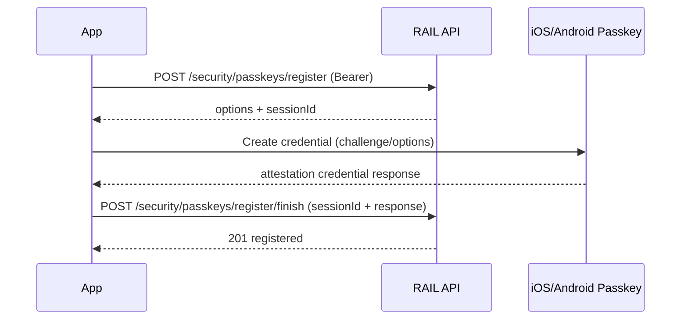
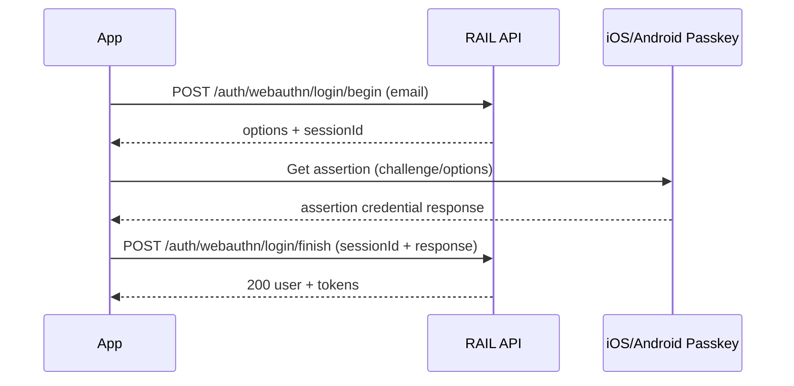

# Passkey Mobile Integration Guide

This document describes how to implement passkeys (WebAuthn backed biometrics) in the mobile app against the RAIL backend.

## 1. Scope

This guide covers:

1. Registering a passkey for an already authenticated user.
2. Logging in with passkey for an unauthenticated user.
3. iOS and Android integration patterns.
4. Error handling, security, and testing.

This guide does not cover:

1. Legacy password login.
2. Passcode setup flows (separate local/passcode auth feature).

## 2. Backend Endpoints

Base path: `/api/v1`

### 2.1 Passkey registration

1. `POST /security/passkeys/register`
2. `POST /security/passkeys/register/finish`
3. `GET /security/passkeys`
4. `DELETE /security/passkeys/:id`

### 2.2 Passkey login

1. `POST /auth/webauthn/login/begin`
2. `POST /auth/webauthn/login/finish`

## 3. Auth and Header Requirements

1. `/security/passkeys/*` endpoints require `Authorization: Bearer <accessToken>`.
2. `/auth/webauthn/login/*` endpoints are unauthenticated.
3. Mobile JSON API calls are exempted from CSRF checks in backend middleware, so no CSRF token is required for native app requests.
4. Use `Content-Type: application/json`.

## 4. Data Contract

## 4.1 Begin registration request

`POST /api/v1/security/passkeys/register`

```json
{
  "name": "iPhone 16 Pro"
}
```

### 4.2 Begin registration response

```json
{
  "options": {
    "publicKey": {
      "rp": { "id": "rail.app", "name": "RAIL" },
      "user": { "id": "<base64url>", "name": "user@example.com", "displayName": "user@example.com" },
      "challenge": "<base64url>",
      "pubKeyCredParams": [ ... ],
      "timeout": 60000,
      "excludeCredentials": [ ... ],
      "authenticatorSelection": { ... },
      "attestation": "none"
    }
  },
  "sessionId": "<opaque_session_id>"
}
```

### 4.3 Finish registration request

`POST /api/v1/security/passkeys/register/finish`

```json
{
  "sessionId": "<sessionId_from_begin>",
  "name": "iPhone 16 Pro",
  "response": {
    "id": "<credential_id_base64url>",
    "rawId": "<credential_id_base64url>",
    "type": "public-key",
    "response": {
      "clientDataJSON": "<base64url>",
      "attestationObject": "<base64url>"
    },
    "clientExtensionResults": {}
  }
}
```

### 4.4 Finish registration success

```json
{
  "message": "Passkey registered successfully",
  "name": "iPhone 16 Pro"
}
```

HTTP status: `201`

### 4.5 Begin login request

`POST /api/v1/auth/webauthn/login/begin`

```json
{
  "email": "user@example.com"
}
```

### 4.6 Begin login response

```json
{
  "options": {
    "publicKey": {
      "challenge": "<base64url>",
      "rpId": "rail.app",
      "allowCredentials": [ ... ],
      "userVerification": "preferred",
      "timeout": 60000
    }
  },
  "sessionId": "<opaque_session_id>"
}
```

### 4.7 Finish login request

`POST /api/v1/auth/webauthn/login/finish`

```json
{
  "sessionId": "<sessionId_from_begin>",
  "response": {
    "id": "<credential_id_base64url>",
    "rawId": "<credential_id_base64url>",
    "type": "public-key",
    "response": {
      "clientDataJSON": "<base64url>",
      "authenticatorData": "<base64url>",
      "signature": "<base64url>",
      "userHandle": "<base64url_or_null>"
    },
    "clientExtensionResults": {}
  }
}
```

### 4.8 Finish login success

Standard auth payload:

```json
{
  "user": {
    "id": "uuid",
    "email": "user@example.com",
    "phone": null,
    "emailVerified": true,
    "phoneVerified": false,
    "onboardingStatus": "wallets_pending",
    "kycStatus": "pending",
    "createdAt": "2026-02-18T12:00:00Z"
  },
  "accessToken": "...",
  "refreshToken": "...",
  "expiresAt": "2026-02-18T12:15:00Z"
}
```

HTTP status: `200`

## 5. Sequence Flows





## 6. Mobile Implementation Pattern

Implement passkey as a state machine to avoid ceremony bugs:

1. `IDLE`
2. `BEGIN_REQUESTED`
3. `OS_PROMPT_ACTIVE`
4. `FINISH_REQUESTED`
5. `SUCCESS` or `FAILED`

Rules:

1. Never reuse a `sessionId` after a finish call.
2. If app backgrounds during OS prompt, discard local in-flight state and restart from begin.
3. Do not cache begin `options` for later reuse. They are challenge-bound and short-lived.

## 7. iOS Notes (AuthenticationServices)

Use native passkeys via `AuthenticationServices`.

Implementation outline:

1. Call backend begin endpoint.
2. Decode base64url fields from `options.publicKey` (`challenge`, `user.id`, credential IDs if needed).
3. For registration: use `ASAuthorizationPlatformPublicKeyCredentialProvider` create request.
4. For login: use same provider assertion request.
5. On success, build WebAuthn JSON object with base64url encoded binary fields.
6. Send object to finish endpoint under `response`.

Important:

1. Keep RP ID aligned with backend config (`rail.app` currently).
2. Use associated domains and passkey entitlement correctly for production domains.
3. Encode binary outputs as base64url without padding to match WebAuthn JSON expectations.

## 8. Android Notes (Credential Manager / FIDO2)

Use Android Credential Manager passkeys.

Implementation outline:

1. Call backend begin endpoint.
2. Use returned publicKey options JSON with credential APIs.
3. Receive credential response JSON from Android API.
4. Parse credential JSON string into object and send as `response` in finish call.

Important:

1. Keep domain/RP ID mapping aligned with backend and app digital asset links.
2. Treat returned credential response as source of truth. Forward it with minimal transformation.
3. If user cancels biometric sheet, map to a user-cancelled state, not an auth failure.

## 9. API Client Methods (Recommended)

Define these app client methods:

1. `beginPasskeyRegistration(name: string) -> { options, sessionId }`
2. `finishPasskeyRegistration(sessionId: string, response: object, name?: string) -> success`
3. `listPasskeys() -> credentials[]`
4. `deletePasskey(id: string) -> success`
5. `beginPasskeyLogin(email: string) -> { options, sessionId }`
6. `finishPasskeyLogin(sessionId: string, response: object) -> AuthResponse`

## 10. Error Handling Matrix

### 10.1 Registration begin/finish

1. `401 UNAUTHORIZED`: user access token missing/expired.
2. `503 WEBAUTHN_UNAVAILABLE`: server WebAuthn disabled/misconfigured.
3. `503 WEBAUTHN_SESSION_UNAVAILABLE`: Redis/session store unavailable.
4. `400 INVALID_SESSION`: session expired, restart from begin.
5. `400 INVALID_WEBAUTHN_RESPONSE`: malformed passkey payload.
6. `400 REGISTRATION_FAILED`: attestation validation/storage failed.

### 10.2 Login begin/finish

1. `404 USER_NOT_FOUND`: email does not exist.
2. `400 LOGIN_ERROR`: no registered credentials or invalid begin state.
3. `400 INVALID_SESSION`: session expired, restart from begin.
4. `401 LOGIN_FAILED`: assertion validation failed.
5. `500 TOKEN_ERROR`: token minting failed.

### 10.3 UX guidance

1. On `INVALID_SESSION`: silently re-run begin once, then prompt retry.
2. On user cancellation: show non-error status, keep user on login screen.
3. On repeated `LOGIN_FAILED`: offer fallback login (password/passcode flow).

## 11. Security Requirements

1. Store access/refresh tokens in secure OS storage only.
2. Never log passkey `response` payload in production logs.
3. Do not persist `sessionId` beyond the in-flight ceremony.
4. Use TLS pinning if your mobile security baseline requires it.
5. Protect login screen against automation and replay by always starting from begin.

## 12. Operational Preconditions

Backend preconditions:

1. `webauthn.rp_id` must be configured.
2. `webauthn.rp_origins` must contain real production origin(s).
3. Redis must be available for WebAuthn ceremony session storage.

If any of the above fails, client should hide passkey CTA and use fallback auth.

## 13. QA Checklist

1. Register passkey on iOS, then login with it.
2. Register passkey on Android, then login with it.
3. Multiple passkeys per account (device A + device B).
4. Delete one passkey and verify others still work.
5. Session expiration: wait until begin session expires, then verify `INVALID_SESSION` recovery.
6. Biometrics cancelled by user and immediate retry.
7. Device clock skew and poor network conditions.
8. Account inactive path returns expected error.

## 14. Rollout Plan

1. Phase 1: internal staff + TestFlight/Internal App Sharing only.
2. Phase 2: 5 percent rollout with metric monitoring.
3. Phase 3: full rollout, then set passkey as primary sign-in option.

Monitor:

1. Begin-to-finish conversion rate.
2. `INVALID_SESSION` frequency.
3. `LOGIN_FAILED` and `REGISTRATION_FAILED` rates.
4. Passkey login success latency percentiles.

## 15. Example App Pseudocode

```ts
async function loginWithPasskey(email: string) {
  const begin = await api.beginPasskeyLogin({ email });

  // OS-level passkey prompt using begin.options
  const assertion = await passkeyProvider.getAssertion(begin.options);

  const auth = await api.finishPasskeyLogin({
    sessionId: begin.sessionId,
    response: assertion,
  });

  await secureStoreTokens(auth.accessToken, auth.refreshToken, auth.expiresAt);
  return auth.user;
}
```

```ts
async function registerPasskey(label: string) {
  const begin = await api.beginPasskeyRegistration({ name: label });

  // OS-level passkey creation using begin.options
  const attestation = await passkeyProvider.createCredential(begin.options);

  await api.finishPasskeyRegistration({
    sessionId: begin.sessionId,
    name: label,
    response: attestation,
  });
}
```

## 16. Source References

1. Route wiring: `/Users/tobi/Development/RAIL_BACKEND/internal/api/routes/routes.go`
2. Handler logic: `/Users/tobi/Development/RAIL_BACKEND/internal/api/handlers/auth/social_auth_handlers.go`
3. WebAuthn service: `/Users/tobi/Development/RAIL_BACKEND/internal/domain/services/webauthn/service.go`
4. Request/response entities: `/Users/tobi/Development/RAIL_BACKEND/internal/domain/entities/social_auth_entities.go`
5. WebAuthn credential table: `/Users/tobi/Development/RAIL_BACKEND/migrations/062_create_social_auth_tables.up.sql`
