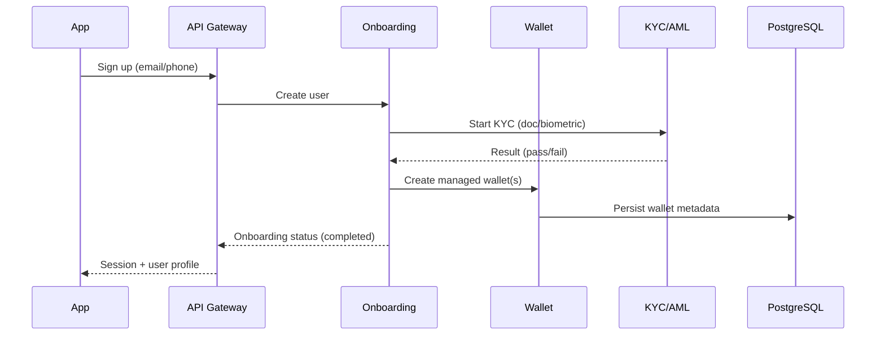
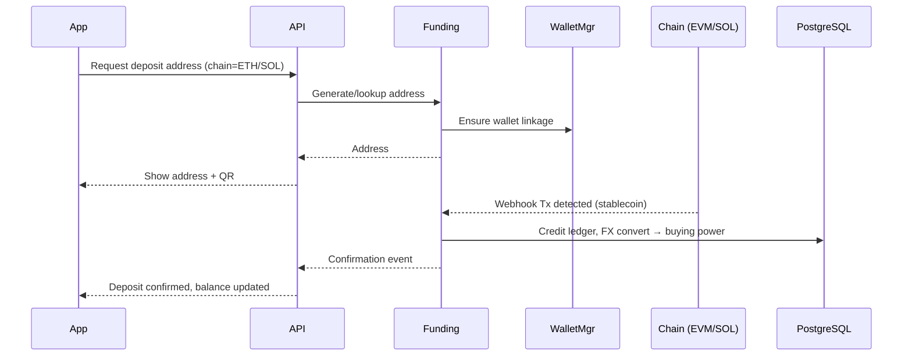
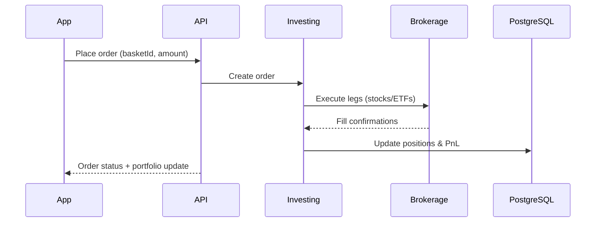
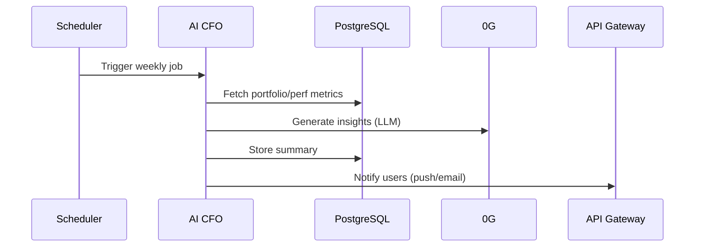

# STACK MVP – High‑Level Architecture (v0.1)

*Date: Sept 27, 2025*

---

## 1) Architectural Overview (C4: System Context)

**Goal:** Hybrid Web3 + TradFi investing with Gen Z‑native UX.

- **Mobile App (React Native)** → **API Gateway (NestJS/Node)** → **Domain Services** (Onboarding, Wallet, Funding, Investing, AI‑CFO) → **Adapters** (Circle, 0G, Brokerage, KYC/AML) → **PostgreSQL** + **Object Storage**.
- **Identity & Auth:** Cognito/Auth0 (OIDC), JWT access tokens. Managed wallet keys abstracted by wallet manager.
- **Data Flow:** Client never touches private keys; all chain/broker interactions go through backend services.

```mermaid
graph TD
  U[Gen Z User (Mobile)] --> RN[React Native App]
  RN --> GW[API Gateway (NestJS)]
  GW --> ONB[Onboarding Service]
  GW --> WAL[Wallet Service]
  GW --> FND[Funding Service]
  GW --> INV[Investing Service]
  GW --> AIC[AI CFO Service]
  ONB --> KYC[KYC/AML Provider]
  WAL --> WMG[Wallet Manager]
  FND --> CIR[Circle APIs]
  FND --> SOL[Solana RPC]
  FND --> ETH[EVM RPC]
  INV --> BRK[Brokerage Partner API]
  AIC --> ZG[0G (AI/Storage)]
  subgraph Data
    PG[(PostgreSQL)]
    OBJ[(Object Storage)]
  end
  ONB --> PG
  WAL --> PG
  FND --> PG
  INV --> PG
  AIC --> PG
  GW --> OBJ
```

---

## 2) Domain Services (MVP)

- **Onboarding Service**: sign‑up, profile, KYC/AML orchestration, feature flags.
- **Wallet Service**: managed wallet lifecycle, address issuance (EVM/SOL), custody abstraction via Wallet Manager.
- **Funding Service**: deposit address generation, webhook listeners, confirmations, auto‑convert → buying power.
- **Investing Service**: basket catalog, orders (buy/sell), portfolio & positions, P&L calc, brokerage adapter.
- **AI‑CFO Service (Lite)**: weekly summaries, on‑demand analysis, insight templates, uses 0G for inference & storage.

## 2.1) Post-MVP Domain Services

- **Conductor Service**: Professional investor platform for copy trading
  - Conductor application and approval workflow
  - Track creation and management (asset baskets: stocks, options, crypto)
  - Copy trading engine to replicate conductor portfolios
  - Performance tracking and conductor rankings
- **AI‑CFO Service (Lite)**: weekly summaries, on‑demand analysis, insight templates, uses 0G for inference & storage.

---

## 3) Key Sequences

### 3.1 Onboarding + Managed Wallet



### 3.2 Stablecoin Deposit → Buying Power



### 3.3 Invest in Basket (Brokerage)



### 3.4 AI‑CFO Weekly Summary



---

## 4) Data Model (MVP tables)

- **users**(id, auth\_provider\_id, kyc\_status, created\_at)
- **wallets**(id, user\_id, chain, address, provider\_ref, status)
- **deposits**(id, user\_id, chain, tx\_hash, token, amount, status, confirmed\_at)
- **balances**(user\_id, buying\_power, updated\_at)
- **baskets**(id, name, description, risk\_level, composition\_json)
- **orders**(id, user\_id, basket\_id, side, amount, status, brokerage\_ref)
- **positions**(id, user\_id, basket\_id, quantity, avg\_price)
- **portfolio\_perf**(user\_id, date, nav, pnl)
- **ai\_summaries**(id, user\_id, week\_start, summary\_md)
- **audit\_logs**(id, actor, action, entity, before, after, at)

---

## 5) APIs (outline)

- **Auth**: `/auth/login`, `/auth/refresh`
- **Onboarding**: `/onboarding/start`, `/onboarding/status`, `/kyc/submit`
- **Wallet**: `/wallet/addresses?chain=eth|sol`, `/wallet/status`
- **Funding**: `/funding/deposit/address`, `/funding/webhooks/chain`, `/funding/confirmations`
- **Baskets**: `/baskets`, `/baskets/{id}`
- **Orders**: `/orders` (POST buy/sell), `/orders/{id}` (GET), `/portfolio`
- **AI‑CFO**: `/ai/summary/latest`, `/ai/analyze`

*All endpoints behind API Gateway with JWT; fine‑grained RBAC enforced server‑side.*

---

## 6) Infrastructure (suggested)

- **Cloud:** AWS (Alt: GCP).
- **Runtime:** ECS/Fargate or EKS (start with ECS).
- **DB:** RDS PostgreSQL (Multi‑AZ), read replica optional.
- **Cache/Queues:** ElastiCache (Redis) for sessions/queues; SQS for async jobs/webhooks.
- **Object Storage:** S3 for reports/exports.
- **Edge:** CloudFront + WAF; API Gateway or ALB + JWT auth.
- **Secrets:** AWS Secrets Manager / Parameter Store.
- **CI/CD:** GitHub Actions → Terraform → ECS blue/green.

---

## 7) Security & Compliance

- **KYC/AML:** integrate provider; store only references, not raw PII images.
- **Custody & Keys:** wallet keys held by provider; never expose to client.
- **PII & Data Minimization:** encrypt at rest (RDS, S3) + in transit (TLS 1.2+).
- **RBAC & Audit:** role‑based authorization; immutable audit logs.
- **Regulatory:** segregate crypto rails vs brokerage; review with counsel; record‑keeping for trade confirmations.
- **Fraud/Abuse:** rate limits, device fingerprinting, anomaly detection on deposits/trades.

---

## 8) Observability & Ops

- **Logging:** structured JSON, correlation IDs across services.
- **Metrics:** p95 latency, deposit confirmation time, order fill time, webhook failure rate.
- **Tracing:** OpenTelemetry → X‑Ray/Tempo.
- **Alerts:** SLOs per service; pager for brokerage/chain webhook failures.

---

## 9) Scalability & Evolution

- Start as **modular monolith** (shared NestJS modules per domain).
- Extract **Funding** and **Investing** as first microservices when throughput/latency or org boundaries demand.
- Introduce **event bus** (SNS/SQS) for deposit/filled‑order events → decouple AI‑CFO & notifications.

---

## 10) Open Decisions (need resolution)

1. **Brokerage partner**: evaluate APIs, settlement, cost, sandbox availability.
2. **Wallet manager**: shortlist providers; confirm EVM + Solana support.
3. **KYC/AML provider**: regional coverage & pricing.
4. **Stablecoin set**: USDC primary? FX strategy for non‑USD users.
5. **Jurisdictions at launch**: compliance scope.

---

## 11) Risks & Mitigations (arch‑specific)

- **Third‑party dependency outages** → circuit breakers, retry with backoff, idempotent jobs, fallback messaging.
- **Webhook reliability** → signed payloads, replay protection, DLQ + reprocessors.
- **Data consistency** → strict ledgers for deposits/balances; outbox pattern for cross‑service events.
- **Cost spikes** → autoscaling policies, budget alarms, cache hot paths (baskets, portfolio reads).

---

### Next Steps

- Define **detailed API contracts** (OpenAPI) for Funding & Investing.
- Create **DB migration plan** (Flyway) and seed data for baskets.
- Draft **runbooks** for deposits, order execution, and AI‑CFO jobs.

